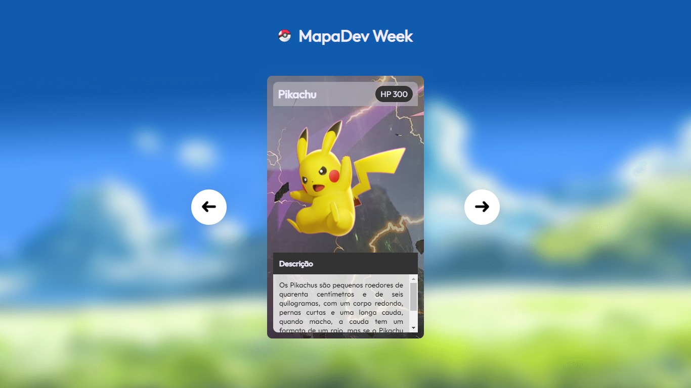

# 👨‍💻 LINK PARA ACESSAR A PAGINA WEB 👇

https://cezardev07.github.io/mapa-dev-week/

 

 

# <h3> Esse Projeto foi criando na imersão mapa dev week, junto com os gêmeos do canal Dev em Dobro 👨‍💻</h3>

 
<h2>⚙️ Tecnologias usadas nesse projeto ⚙️<h2>
<ul>
    <li>Html5</li>
    <li>Css3</li>
    <li>JavaScript</li>
</ul>

<h3>O foco desse projeto foi ajudar pessoas iniciante a começar na área de desenvolvimento-web front-end, e também mostrar um pouco de logica de programação e como manipular o DOM com o JavaScript</h3>
 

<h2>🔗Links das redes sociais dos gêmeos caso queira conferir o trabalho deles⚔️</h2>

<ul>
    <li><a href="https://instagram.com/devemdobro?igshid=YmMyMTA2M2Y=" target="_blank" rel="noopener noreferrer">Instagram</a>
    </li>
    <li><a href="https://youtube.com/c/DevemDobro" target="_blank" rel="noopener noreferrer">Youtube</a>
    </li>
</ul>

